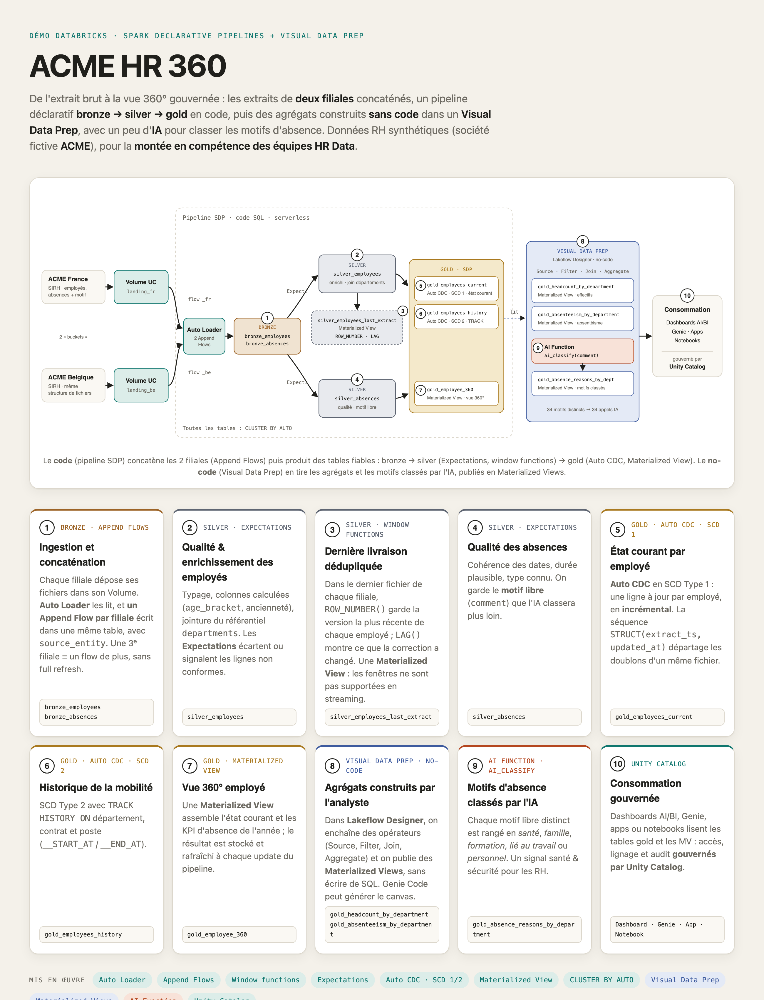

# ACME HR 360 — Démo Data + Spark Declarative Pipelines (SDP)

Asset de démonstration pour **faire monter en compétence les équipes HR Data sur Databricks et les
Spark Declarative Pipelines (SDP)**. Il construit, de bout en bout et avec des **données HR
synthétiques**, une **vue 360° des employés** (*HR 360*) :

> extraits du SIRH de **deux filiales** déposés chacun dans son **Volume Unity Catalog** → ingestion
> **Auto Loader** et concaténation par **Append Flows**
> → **Spark Declarative Pipeline** (bronze → silver → gold) → agrégats **no-code** dans un **Visual
> Data Prep** (avec **IA**) → **Materialized Views**, le tout gouverné par **Unity Catalog**
> et déployé par un **Databricks Asset Bundle**.

Pensé comme **support d'atelier / d'enablement** : chaque étape est annotée et illustre une
fonctionnalité SDP dans un scénario métier HR réaliste.

> **SDP** (Spark Declarative Pipelines) = **LDP** (Lakeflow Declarative Pipelines), anciennement DLT —
> termes interchangeables.

## Ce que la démo illustre (fonctionnalités SDP)

| Fonctionnalité SDP | Où | Rôle dans le pipeline (bronze→silver→gold) |
|---|---|---|
| **Streaming Table** + **Auto Loader** (`STREAM read_files`) | `bronze_employees`, `bronze_absences` | Ingestion des données brutes — bronze |
| **Append Flows** (`CREATE FLOW … INSERT INTO`) | `bronze_employees`, `bronze_absences` | Concaténation de 2 sources de même structure (filiales FR et BE, 2 Volumes) — bronze |
| **Expectations** (contrôles qualité déclaratifs) | `silver_employees`, `silver_absences` | Contrôles qualité — silver |
| Colonnes calculées (`age_bracket`, `seniority_years`) + join référentiel | `silver_employees` | Préparation & enrichissement — silver |
| **Window functions** (`ROW_NUMBER`, `COUNT OVER`, `LAG`) dans une **Materialized View** | `silver_employees_last_extract` | Dernière ligne par employé dans le dernier fichier livré — silver |
| **Auto CDC — SCD Type 1** (dernière version / employé, `SEQUENCE BY STRUCT(extract_ts, updated_at)`) | `gold_employees_current` | Déduplication incrémentale / dernière valeur — gold |
| **Auto CDC — SCD Type 2** (historique mobilité) | `gold_employees_history` | Historisation — gold |
| **Materialized View** (résultat stocké, rafraîchi par le pipeline) | `gold_employee_360` | Vue 360° employé exposée aux consommateurs — gold |
| **`CLUSTER BY AUTO`** (liquid clustering automatique) | toutes les tables du pipeline | Performance sans réglage manuel |
| **Visual Data Prep** (Lakeflow Designer, no-code) → **Materialized Views** | `gold_headcount_by_department`, `gold_absenteeism_by_department` | Agrégats de consommation construits par un analyste — gold |
| **AI Function** `ai_classify` (no-code) | `gold_absence_reasons_by_department` | Classement IA des motifs d'absence en texte libre |
| **Job** DAB (pipeline → Visual Data Prep) | `hr_360_job` | Orchestration de bout en bout |

Scénario : deux filiales, **ACME France** et **ACME Belgique**, livrent chacune leurs extraits
**Employés + Absences** (même structure) dans leur propre stockage ; référentiel **Départements**
partagé (effectifs, pyramide des âges, mixité, absentéisme, motifs d'absence).

## Architecture



```
Volume UC landing_fr (ACME France)        Volume UC landing_be (ACME Belgique)
   ├── employees/  (JSONL)                    ├── employees/  (JSONL, même structure)
   └── absences/   (JSONL)                    └── absences/   (JSONL)
        │  Auto Loader · flow *_fr                  │  Auto Loader · flow *_be
        └──────────────────┬────────────────────────┘
                           ▼  Append Flows (concaténation, colonne source_entity)
BRONZE  bronze_employees · bronze_absences                     (streaming tables)
        ▼  nettoyage, typage, colonnes calculées, expectations, join acme_hr.departments
SILVER  silver_employees · silver_absences                     (streaming tables + expectations)
        silver_employees_last_extract   (materialized view · ROW_NUMBER / LAG : dernière livraison)
        ▼
GOLD    gold_employees_current        (Auto CDC SCD1 — état courant)
        gold_employees_history        (Auto CDC SCD2 — historique)
        gold_employee_360           (materialized view de consommation)
        ▼  Visual Data Prep (Lakeflow Designer, no-code) — src/02-Visual-Data-Prep/
        gold_headcount_by_department        (materialized view)
        gold_absenteeism_by_department      (materialized view)
        gold_absence_reasons_by_department  (materialized view · AI Function ai_classify)
```

Catalog `alp_demo_catalog` · schéma unique `acme_hr` · référentiel `departments` ·
données brutes dans les Volumes `alp_demo_catalog.acme_hr.landing_fr` et `landing_be`. Tables préfixées par couche
(`bronze_` / `silver_` / `gold_`). Les autres démos auront leur propre schéma dans ce catalog.

## Prérequis

Tout se fait **dans l'UI du workspace Databricks** : aucun outil à installer en local.

- Un workspace Databricks avec Unity Catalog et le compute **serverless**.
- Droits `ALL_PRIVILEGES` (ou CREATE SCHEMA / VOLUME) sur le catalog **`alp_demo_catalog`**
  (à adapter à votre catalog dans `databricks.yml` et les notebooks).
- Le repo cloné dans un **Git folder** : **+ New → Git folder**, URL de ce repo, branche `main`.

> Le stockage, ce sont des **Volumes Unity Catalog** (un par filiale) : pas de bucket, de rôle IAM
> ou de credential à provisionner. En production, chaque Volume pourrait être un Volume externe
> posé sur le bucket de la filiale ; le pipeline ne change pas.

## Déroulé (pas à pas)

> **Vous venez d'une version précédente de la démo** (un seul Volume `landing`) ? Le schéma des
> données a changé : supprimez l'ancien Volume `landing` (ou tout le schéma `acme_hr`), rejouez les
> étapes 1 et 2, puis lancez le pipeline en **full refresh** à l'étape 3.

### 1. Setup Unity Catalog (schéma + Volumes) & master data
Dans le Git folder, ouvrir le notebook `src/00-Utiles/00-MasterData-build` et faire **Run all**. Il crée
le schéma `acme_hr`, les **Volumes** `landing_fr` et `landing_be` (un par filiale, sous-dossiers
`employees/` et `absences/`) et le référentiel `alp_demo_catalog.acme_hr.departments`.

### 2. Générer et charger les données brutes dans le Volume
Ouvrir le notebook `src/00-Utiles/01-Generate-HR-Data` et faire **Run all** **deux fois**, une par
filiale. Widgets :
- `entity` = **`FR`** au premier run, puis **`BE`** au second (par exemple 50 000 puis 10 000 employés) ;
- `mode` = **`seed`** : charge initiale, 50 000 employés et 12 mois d'absences par défaut (widget `employees`) ;
- `bad_records` = **`yes`** (défaut) : ajoute quelques lignes volontairement non conformes pour voir
  les Expectations en action.

Le notebook écrit les extraits JSONL **directement dans le Volume de la filiale**
(`.../landing_fr/…` ou `.../landing_be/…`) et garde un roster par filiale dans `_state/roster.json`,
pour que les identifiants (`EMPFR…`, `EMPBE…`) restent stables entre les runs. Chaque extrait contient
aussi environ 2 % d'employés en plusieurs versions (corrections dans la journée, `updated_at`) : c'est
la matière de l'exemple de fonction de fenêtre. Vérification : **Catalog Explorer →
`alp_demo_catalog` → `acme_hr` → Volumes**.

### 3. Déployer et lancer le pipeline (UI du bundle)
Le pipeline est décrit par le **bundle** (`databricks.yml` et `resources/hr_pipeline_dlt.pipeline.yml`) ;
on le déploie depuis l'UI, sans CLI.

1. Dans le Git folder, ouvrir `databricks.yml`, puis le panneau **Deployments** (icône 🚀 dans la barre
   latérale de l'éditeur).
2. Choisir la cible **`dev`** et cliquer **Deploy**. Le panneau liste les ressources créées : le
   pipeline `[dev <votre_nom>] HR_360_Pipeline_dev`.
3. Dans ce même panneau, cliquer **Run** sur `hr_pipeline_dlt` (ou ouvrir le pipeline puis **Start**).
4. Suivre le graphe : bronze → silver → gold. L'onglet **Data quality** montre les lignes rejetées
   par les Expectations.

> En cible `dev`, le déploiement est **lié à la source** : le pipeline lit directement les fichiers
> SQL du Git folder. Une modification du code est prise en compte au run suivant, sans redéployer.

> **Alternative CLI** (optionnelle) : `databricks bundle deploy -t dev` puis
> `databricks bundle run hr_pipeline_dlt -t dev`, avec un profil CLI authentifié.

### 4. Construire les agrégats en no-code (Visual Data Prep + IA)
Suivre le guide [`src/02-Visual-Data-Prep/README.md`](src/02-Visual-Data-Prep/README.md) : dans
Lakeflow Designer, un analyste construit sans code les Materialized Views d'effectifs et
d'absentéisme, et classe les motifs d'absence en texte libre avec l'opérateur **AI Function**
(`ai_classify`). Un prompt **Genie Code** prêt à coller permet de générer le canvas.

### 5. Explorer les résultats
Lancer les requêtes de `src/01-HR_DLT/03-Explorations/hr_exploration.sql` sur un SQL Warehouse
(streaming tables, SCD1/SCD2, materialized views, motifs classés par l'IA, vue 360° employé).

### 6. Démontrer l'incrémental + le CDC
Relancer le notebook `01-Generate-HR-Data` avec le widget `mode` = **`increment`** : il produit un
nouvel extrait employés (mobilités / embauches / départs) daté d'un `extract_ts` plus récent. Puis
relancer le pipeline avec **Run** dans le panneau Deployments, ou **Start** sur le pipeline. Il faut
un run **normal**, pas une full refresh.

Seuls les nouveaux fichiers sont ingérés (Auto Loader, directory-listing sur le Volume).
`gold_employees_current` reflète l'état à jour (SCD1) ; `gold_employees_history` accumule
l'historique des mobilités (SCD2, ordonné par `extract_ts`).

## Aller plus loin (optionnel)
- **Dashboard AI/BI** sur `gold_headcount_by_department`, `gold_absenteeism_by_department` et
  `gold_employee_360` (effectifs par BU, pyramide des âges, taux d'absentéisme par mois/type).
- **Planifier** le job `hr_360_job` (schedule + notifications).
- Ajouter d'autres sources HR (paie, formation) en réutilisant le même squelette bronze→silver→gold.

## Structure
```
acme_hr_sdp_demo/
├── databricks.yml                     # bundle DAB clean (variables, targets dev/prod)
├── docs/                              # diagramme d'architecture (PNG + source HTML)
├── resources/
│   └── hr_pipeline_dlt.pipeline.yml   # pipeline SDP serverless
└── src/
    ├── 00-Utiles/
    │   ├── 00-MasterData-build.py     # setup : schémas + Volume + référentiel departments
    │   └── 01-Generate-HR-Data.py     # générateur HR synthétique en NOTEBOOK (widgets, écrit dans le Volume)
    ├── 01-HR_DLT/
    │   ├── 00-Data-Sources/           # bronze (Auto Loader)
    │   ├── 01-Employees/              # silver + gold (SCD1/SCD2)
    │   ├── 02-Absences/               # silver + view de consommation
    │   └── 03-Explorations/           # requêtes de validation (hors pipeline)
    └── 02-Visual-Data-Prep/           # agrégats no-code + IA (Lakeflow Designer) — voir son README
```
