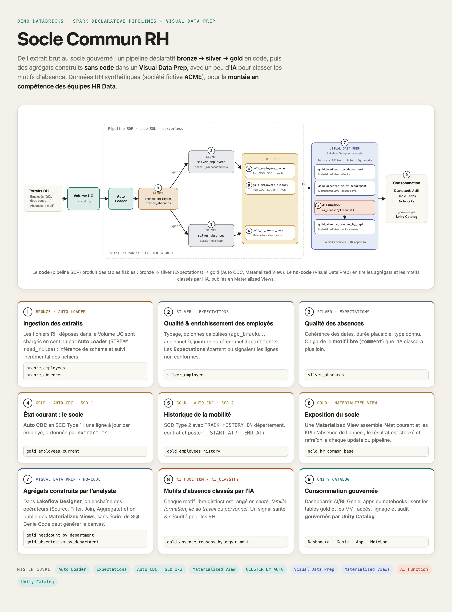

# ACME HR "Common Base" — Démo Data + Spark Declarative Pipelines (SDP)

Asset de démonstration pour **faire monter en compétence les équipes HR Data sur Databricks et les
Spark Declarative Pipelines (SDP)**. Il construit, de bout en bout et avec des **données HR
synthétiques**, un **socle commun HR** (*Common Base*) :

> extraits HR (type CESAM/SESAM) déposés dans un **Volume Unity Catalog** → ingestion **Auto Loader**
> → **Spark Declarative Pipeline** (bronze → silver → gold) → agrégats **no-code** dans un **Visual
> Data Prep** (avec **IA**) → **Materialized Views** + **View**, le tout gouverné par **Unity Catalog**
> et déployé par un **Databricks Asset Bundle**.

Pensé comme **support d'atelier / d'enablement** : chaque étape est annotée et illustre une
fonctionnalité SDP dans un scénario métier HR réaliste.

> **SDP** (Spark Declarative Pipelines) = **LDP** (Lakeflow Declarative Pipelines), anciennement DLT —
> termes interchangeables.

## Ce que la démo illustre (fonctionnalités SDP)

| Fonctionnalité SDP | Où | Rôle dans le socle (bronze→silver→gold) |
|---|---|---|
| **Streaming Table** + **Auto Loader** (`STREAM read_files`) | `bronze_employees`, `bronze_absences` | Ingestion des données brutes — bronze |
| **Expectations** (contrôles qualité déclaratifs) | `silver_employees`, `silver_absences` | Contrôles qualité — silver |
| Colonnes calculées (`age_bracket`, `seniority_years`) + join référentiel | `silver_employees` | Préparation & enrichissement — silver |
| **Auto CDC — SCD Type 1** (dernière version / employé) | `gold_employees_current` | Déduplication / dernière valeur — gold |
| **Auto CDC — SCD Type 2** (historique mobilité) | `gold_employees_history` | Historisation — gold |
| **View** (calcul à la volée, UC) | `gold_hr_common_base` | Exposition aux consommateurs — gold |
| **`CLUSTER BY AUTO`** (liquid clustering automatique) | toutes les tables du pipeline | Performance sans réglage manuel |
| **Visual Data Prep** (Lakeflow Designer, no-code) → **Materialized Views** | `gold_headcount_by_department`, `gold_absenteeism_by_department` | Agrégats de consommation construits par un analyste — gold |
| **AI Function** `ai_classify` (no-code) | `gold_absence_reasons_by_department` | Classement IA des motifs d'absence en texte libre |
| **Job** DAB (pipeline → Visual Data Prep) | `hr_common_base_job` | Orchestration de bout en bout |

Scénario : **Employés + Absences + Départements** (effectifs, pyramide des âges, mixité,
absentéisme, motifs d'absence).

## Architecture



```
Volume UC  /Volumes/alp_demo_catalog/acme_hr/landing/
   ├── employees/   extraits master employés (JSONL, GID stables)
   └── absences/    événements d'absence (JSONL)
        │  Auto Loader
        ▼
BRONZE  bronze_employees · bronze_absences                     (streaming tables)
        ▼  nettoyage, typage, colonnes calculées, expectations, join acme_hr.departments
SILVER  silver_employees · silver_absences                     (streaming tables + expectations)
        ▼
GOLD    gold_employees_current        (Auto CDC SCD1 — le "socle commun")
        gold_employees_history        (Auto CDC SCD2 — historique)
        gold_hr_common_base           (view UC de consommation)
        ▼  Visual Data Prep (Lakeflow Designer, no-code) — src/02-Visual-Data-Prep/
        gold_headcount_by_department        (materialized view)
        gold_absenteeism_by_department      (materialized view)
        gold_absence_reasons_by_department  (materialized view · AI Function ai_classify)
```

Catalog `alp_demo_catalog` · schéma unique `acme_hr` · référentiel `departments` ·
données brutes dans le Volume `alp_demo_catalog.acme_hr.landing`. Tables préfixées par couche
(`bronze_` / `silver_` / `gold_`). Les autres démos auront leur propre schéma dans ce catalog.

## Prérequis

- Databricks CLI ≥ 1.0 authentifié sur le profil **`<your-profile>`**.
- Droits `ALL_PRIVILEGES` (ou CREATE SCHEMA / VOLUME) sur le catalog **`alp_demo_catalog`**.
- La génération de données tourne **dans le workspace** (notebook `01-Generate-HR-Data.py`, qui
  installe Faker via `%pip`) — aucune dépendance à installer en local.

> Le stockage est un **Volume Unity Catalog** — plus aucun bucket S3, rôle IAM ou credential à
> provisionner. Le Volume vit dans le compte du votre workspace Databricks et est gouverné par UC.

## Déroulé (pas à pas)

### 1. Setup Unity Catalog (schémas + Volume) & master data
Exécuter le notebook `src/00-Utiles/00-MasterData-build.py` dans le votre workspace Databricks. Il crée le
schéma `acme_hr`, le **Volume** `alp_demo_catalog.acme_hr.landing` (sous-dossiers `employees/`,
`absences/`) qui recevra les extraits bruts, et le référentiel `alp_demo_catalog.acme_hr.departments`.

### 2. Générer et charger les données brutes dans le Volume
Exécuter le notebook `src/00-Utiles/01-Generate-HR-Data.py` dans le workspace, avec les widgets :
`mode` = **`seed`** (charge initiale : ~2500 employés + 12 mois d'absences), `employees`, `catalog`,
`schema`. Il écrit les extraits JSONL **directement dans le Volume** (`.../landing/employees|absences/`)
et persiste le roster dans `.../landing/_state/roster.json` (GID stables entre les runs — indispensable
pour démontrer le CDC / SCD).

```bash
# Vérifier le dépôt des fichiers dans le Volume (depuis le terminal, optionnel)
databricks fs ls dbfs:/Volumes/alp_demo_catalog/acme_hr/landing/employees --profile <your-profile>
```

### 3. Déployer et lancer le pipeline LDP
```bash
databricks bundle validate -t dev --profile <your-profile>
databricks bundle deploy   -t dev --profile <your-profile>
databricks bundle run hr_pipeline_dlt -t dev --profile <your-profile>
```

### 4. Construire les agrégats en no-code (Visual Data Prep + IA)
Suivre le guide [`src/02-Visual-Data-Prep/README.md`](src/02-Visual-Data-Prep/README.md) : dans
Lakeflow Designer, un analyste construit sans code les Materialized Views d'effectifs et
d'absentéisme, et classe les motifs d'absence en texte libre avec l'opérateur **AI Function**
(`ai_classify`). Un prompt **Genie Code** prêt à coller permet de générer le canvas.

### 5. Explorer les résultats
Lancer les requêtes de `src/01-HR_DLT/03-Explorations/hr_exploration.sql` sur un SQL Warehouse
(streaming tables, SCD1/SCD2, materialized views, motifs classés par l'IA, view).

### 6. Démontrer l'incrémental + le CDC
Relancer le notebook `01-Generate-HR-Data.py` avec le widget `mode` = **`increment`** : il produit un
nouvel extrait employés (mobilités / embauches / départs) daté d'un `extract_ts` plus récent, puis
relancer le pipeline (run **normal**, pas full-refresh) :
```bash
databricks bundle run hr_pipeline_dlt -t dev --profile <your-profile>
```
Seuls les nouveaux fichiers sont ingérés (Auto Loader, directory-listing sur le Volume).
`gold_employees_current` reflète l'état à jour (SCD1) ; `gold_employees_history` accumule
l'historique des mobilités (SCD2, ordonné par `extract_ts`).

## Aller plus loin (optionnel)
- **Dashboard AI/BI** sur `gold_headcount_by_department`, `gold_absenteeism_by_department` et
  `gold_hr_common_base` (effectifs par BU, pyramide des âges, taux d'absentéisme par mois/type).
- **Planifier** le job `hr_common_base_job` (schedule + notifications).
- Ajouter d'autres sources HR (paie, formation) en réutilisant le même squelette bronze→silver→gold.

## Structure
```
acme_hr_sdp_demo/
├── databricks.yml                     # bundle DAB clean (variables, targets dev/prod)
├── docs/                              # diagramme d'architecture
├── resources/
│   └── hr_pipeline_dlt.pipeline.yml   # pipeline SDP serverless
└── src/
    ├── 00-Utiles/
    │   ├── 00-MasterData-build.py     # setup : schémas + Volume + référentiel departments
    │   └── 01-Generate-HR-Data.py     # générateur HR synthétique en NOTEBOOK (widgets, écrit dans le Volume)
    ├── 01-HR_DLT/
    │   ├── 00-Data-Sources/           # bronze (Auto Loader)
    │   ├── 01-Employees/              # silver + gold (SCD1/SCD2)
    │   ├── 02-Absences/               # silver + view de consommation
    │   └── 03-Explorations/           # requêtes de validation (hors pipeline)
    └── 02-Visual-Data-Prep/           # agrégats no-code + IA (Lakeflow Designer) — voir son README
```
